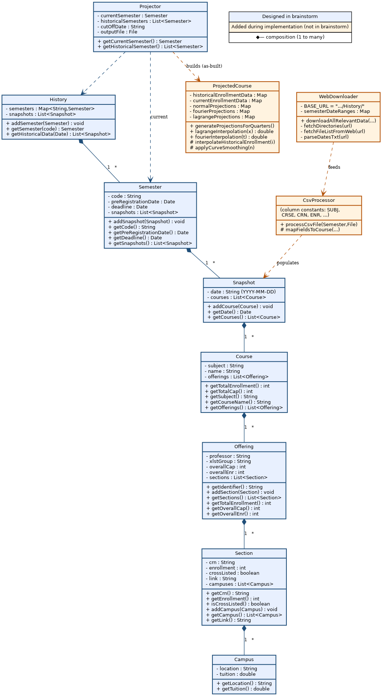

# Design Review — Enrollment Projection Project

**Subject:** CS 350 "TA2 Brainstorm" class design vs. the as-built implementation
**Source design:** *CS 350 TA2 Brainstorm* (Google Doc)
**Reviewed against:** `project/src/main/java/edu/odu/cs/cs350/` (Java) + `sda.py`

---

## 1. Summary

The brainstorm is a strong **structural** design and a weak **systems** design. It
nails the domain model — the noun hierarchy it specifies survived almost unchanged
into the shipped code — but it leaves out the two hardest and most valuable parts of
the finished program: **how data is acquired** and **how enrollment is actually
projected**. Those were designed-by-coding later. The result is a real, working
application, but one whose core intellectual content has no counterpart in the
original plan.

Overall grade of the design as a predictor of the build: **B–**. Object model A;
system/algorithm coverage D.

---

## 2. What the brainstorm specifies

Eight classes in a clean containment chain plus a thin orchestrator:

```
Projector
History → Semester → Snapshot → Course → Offering → Section → Campus
```

Each class is defined CRC-style (attributes + getter/adder operations). Notable
strengths:

- **Accurate domain modeling.** It captures registrar realities most student
  designs miss: cross-listing (`xlstGroup` / `Link`), CRNs, the Offering-vs-Section
  distinction (a course offering containing multiple lecture/lab sections), and
  per-campus tuition.
- **Consistent encapsulation.** Every field is private with explicit accessors and
  `addX()` mutators — a disciplined, uniform style.
- **Clear ownership.** Composition is unambiguous: a Semester owns its Snapshots, a
  Snapshot owns its Courses, and so on down to Sections and Campuses.

---

## 3. Design vs. implementation: traceability

| Brainstorm class | Built? | Notes on divergence |
|---|---|---|
| `History` | ✅ `History.java` | Implemented; `semesters` "dict" became a Java `Map`. |
| `Semester` | ✅ `Semester.java` | **Grew** the critical `normalizeDate()` method (not in design). |
| `Snapshot` | ✅ `Snapshot.java` | As designed. |
| `Course` | ✅ `Course.java` | `name` → `course_id` = `subject_courseNumber`. |
| `Offering` | ✅ `Offering.java` | `getIdentifier()` became a composite `offering_id`. |
| `Section` | ✅ `Section.java` | `campuses : List<Campus>` collapsed to a `String campus`; added `section_type` (Lecture/Recitation/Lab) from the `LINK` suffix. |
| `Campus` | ❌ | **No `Campus.java`.** Location/tuition dropped entirely. |
| `Projector` | ⚠️ rewritten | Planned fields (`cutOffDate`, `outputFile`, `historicalSemesters`) replaced by `projections : Map`, `summaryReport`, `currentSemesterCourses`. |
| — | ➕ `ProjectedCourse` | **Net-new.** Holds all projection math. No design counterpart. |
| — | ➕ `WebDownloader` | **Net-new.** Scrapes/downloads snapshots. No design counterpart. |
| — | ➕ `CsvProcessor` | **Net-new.** Parses snapshot CSVs by column name. No design counterpart. |
| — | ➕ `DateReader`, `FileProcessor`, `SummaryProjectionReport`, `DetailedReportGenerator`, `ValidationUtils` | Supporting I/O & reporting, none designed. |

---

## 4. Principal gaps in the brainstorm

### 4.1 The projection algorithm is undefined
`Projector` lists only `getCurrentSemester()` and `getHistoricalSemester()`. There
is **no operation that projects anything.** The entire forecasting engine — date
normalization to a 0–1 term-progress axis, plus three interpolation strategies
(ratio-scaled "Normal," Lagrange polynomial, Fourier series) implemented in the
unplanned `ProjectedCourse` — was invented during coding. This is the heart of the
product, and the design is silent on it.

### 4.2 The data-acquisition layer is missing
Nothing in the brainstorm describes obtaining data: no scraping of
`cs.odu.edu/~zeil/courseSchedule/History/`, no `dates.txt` parsing, no CSV reader.
The design implicitly assumes Semesters and Snapshots already exist in memory. In
reality `WebDownloader` + `CsvProcessor` are a substantial, non-trivial subsystem
(HTML regex scraping, semester date-range filtering, column-mapped CSV parsing).

### 4.3 Over-modeling that never shipped
`Campus` (location + tuition) was fully specified but never built — tuition is
irrelevant to an enrollment-*count* projector. This is scope the design should have
deferred.

---

## 5. Specification defects (internal to the doc)

- **Type inconsistency.** `Snapshot.date` is declared `String` but its accessor
  returns `Date`; `Semester.snapshots` and `History.snapshots` both exist, implying
  duplicated state.
- **Language leakage.** `History.semesters` is described as a "dict" and
  `Projector.cutOffDate` as a `String` — Python/stringly-typed thinking in a Java
  project. The implementation correctly moved to `Map` and `LocalDate`.
- **Redundant storage.** `History` holds both a `semesters` map and a separate
  `snapshots` list with `getHistoricalData(Date)`. The snapshots are already
  reachable through the semesters; the parallel list invites drift.
- **Missing UML.** The document ends with an `[image]` placeholder where the class
  diagram should be — so the one artifact that would have exposed gaps 4.1–4.2 was
  never produced. (A reconstructed diagram is provided in
  `images/uml_class_diagram.png`.)

---

## 6. What the design got right (worth keeping)

- The Semester→Snapshot→Course→Offering→Section spine is correct and shipped intact.
- Modeling cross-listing and the Offering/Section split early prevented a whole
  class of later refactors.
- Uniform encapsulation made the model easy to extend (e.g., bolting
  `normalizeDate()` onto `Semester` and adding `ProjectedCourse` alongside `Course`
  cost nothing structurally).

---

## 7. Recommendations

1. **Specify the algorithm before coding it.** Add a projection operation contract
   to `Projector`/`ProjectedCourse`: inputs (historical curve, current snapshots),
   the normalization definition, and the chosen method(s) with error metrics.
2. **Add a data-ingestion subsystem to the design.** A `DataSource`/`WebDownloader`
   + `CsvProcessor` boundary, with the History-site URL scheme and `dates.txt`
   contract documented.
3. **Cut `Campus` (or justify it).** Remove tuition/location unless a downstream
   feature needs it; otherwise it's dead weight.
4. **Fix the types in the model.** Dates as `LocalDate` throughout; one source of
   truth for snapshots (own them via Semesters, not a second list on History).
5. **Always produce the UML.** The diagram is where the "no projection method" and
   "no data source" gaps become obvious at a glance.

---

*Reconstructed UML class diagram accompanying this review:*



Blue = classes specified in the brainstorm. Orange = classes that exist only in the
implementation (no design counterpart). Diamonds denote composition (1-to-many).
