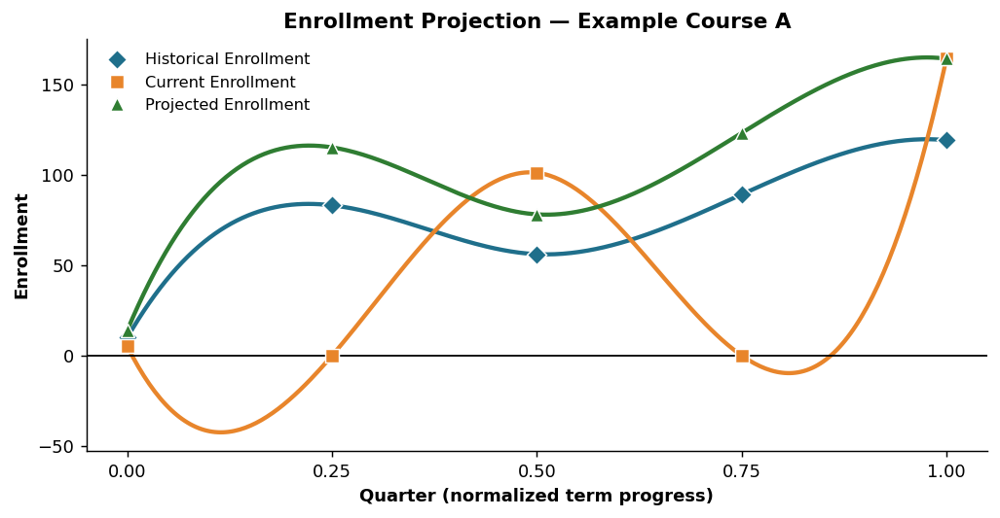
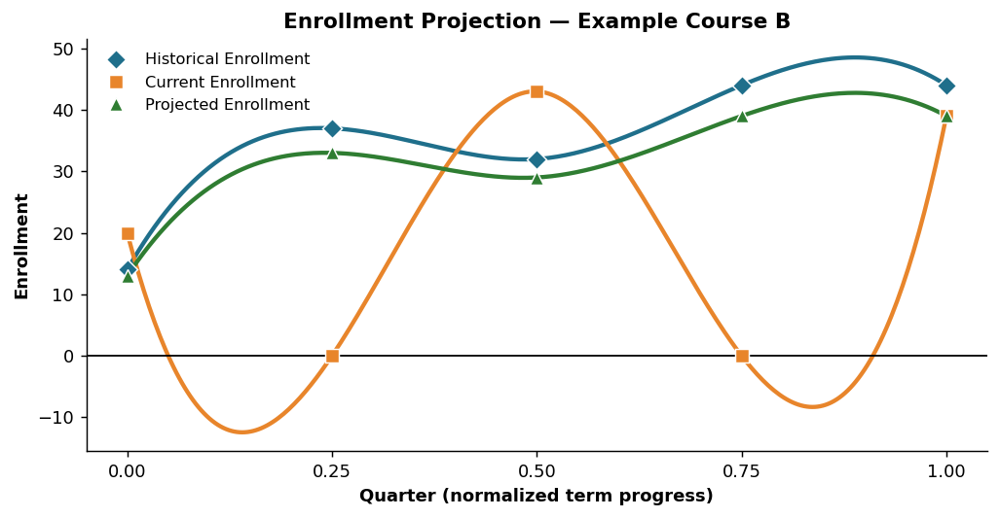

* [Design Brainstorm](https://docs.google.com/document/d/1OQ0Xv7hy7S868KrXXS7HTUkGfZLbmSvmY7WGknZN2Ls/edit?tab=t.0)

# Enrollment Projection Project

A Java application that **projects final course enrollment** for an upcoming/active
semester by downloading historical registration snapshots from Old Dominion
University's public course-schedule archive, normalizing them onto a common
"term-progress" timeline, and using several interpolation/scaling methods to
forecast where each course's enrollment will land by the add deadline.

Originally built for **ODU CS 350 (Software Engineering)**. Core language: **Java**
(Gradle build), with a small **Python** companion script (`sda.py`) that mirrors the
data model for experimentation.

---

## What problem it solves

Departments need to know, *early in registration*, how full a class will eventually
be so they can add/cut sections and assign instructors. Early in the term a class
might show only a handful of students, but history tells us how that same class
*fills in* as the term approaches. This project learns the **shape of the fill-in
curve** from past semesters and applies it to the current semester's partial data.

---

## How it pulls the data

All historical data comes from Steven Zeil's public archive:

> **`https://www.cs.odu.edu/~zeil/courseSchedule/History/`**

The downloading is handled by **`WebDownloader.java`**, which scrapes the directory
listing pages with regular expressions (no API exists — it parses the HTML index):

1. **Find every semester.** It `GET`s the `History/` index and matches semester
   folders with the pattern `href="(\d{6})/"`, giving codes like `202410`,
   `202420` (`YYYYTT`, where `TT` is `10`=Spring, `20`=Summer, `30`=Fall).

2. **Identify the current semester.** For each folder it downloads `dates.txt`
   (first line = start date, second line = end date) and picks the semester whose
   `[startDate, endDate]` range contains *today*.

3. **Walk backwards through history.** `getPreviousSemesters(...)` steps the term
   code back by `10` each time (rolling `10 → 30` and decrementing the year when it
   underflows) to collect the previous *N* semesters (default 4–10).

4. **Download the daily snapshots.** For each semester folder it lists files with
   the pattern `href="(\d{4}-\d{2}-\d{2}\.csv)"` and downloads every
   `YYYY-MM-DD.csv` whose date falls inside that semester's date range. Each CSV is
   a **snapshot** of enrollment on that calendar day.

```
History/
├── 202410/
│   ├── dates.txt          ← startDate / endDate
│   ├── 2024-01-02.csv     ← daily enrollment snapshot
│   ├── 2024-01-09.csv
│   └── ...
├── 202420/
└── ...
```

Snapshots are saved locally (the code uses `C:\SemesterData\<semester>\`) and then
parsed into the object model.

---

## Data model

`CsvProcessor.java` reads each snapshot CSV by **column name** (`SUBJ`, `CRSE`,
`CRN`, `XLST GROUP`, `XLST CAP`, `ENR`, `OVERALL CAP`, `OVERALL ENR`,
`INSTRUCTOR`, `LINK`, `CAMPUS`) and builds a hierarchy:

```
Semester  ──has many──▶ Snapshot (one per day)
Snapshot  ──has many──▶ Course   (e.g. CS 251)
Course    ──has many──▶ Offering (a course + cross-list group + instructor)
Offering  ──has many──▶ Section  (a CRN; Lecture/Recitation/Lab via LINK code)
```

A `Section`'s `LINK` code suffix classifies it: `…1`=Lecture, `…2`=Recitation,
`…3`=Lab. Enrollment rolls up Section → Offering → Course → Snapshot.

---

## The key idea: normalizing dates to a 0–1 timeline

Different semesters have different calendars, so raw dates can't be compared
directly. `Semester.normalizeDate()` maps each snapshot date onto a fraction of
**term progress** between two anchors:

- **0.0** = the **pre-registration date** (term hasn't started filling)
- **1.0** = the **add deadline** (enrollment is effectively final)

```
normalized = daysBetween(preRegDate, snapshotDate)
             ────────────────────────────────────
             daysBetween(preRegDate, addDeadline)
```

This puts *every* semester — past and present — on the same horizontal axis (the
"Quarter" axis in the charts below), so a point at `0.5` always means "halfway
through the registration window," regardless of the actual calendar year.

---

## The projection math

`Projector.java` loads the historic semesters and the current semester, then for
each course builds a `ProjectedCourse` holding two curves:

- **Historical enrollment** `h(d)` — average enrollment at each normalized date
  `d`, aggregated across all past semesters.
- **Current enrollment** `c(d)` — this semester's snapshots so far (sparse — many
  normalized dates have no snapshot yet, which is why the orange "Current" series
  dips to 0 between known points in the charts).

It then projects forward to a set of target points
(`0.0, 0.11, 0.21, 0.25, … 0.91, 0.99, 1.00`) using **three independent methods**,
each implemented in `ProjectedCourse.java`:

### 1. Normal projection (ratio scaling)

Scale the most recent *current* enrollment by how much the *historical* curve grows
from now until the target date:

```
                    recentEnrollment
projection(target) = ──────────────── × h(target)
                     h(recentIndex)
```

where `h(...)` values come from **linear interpolation** of the historical curve
(`interpolateHistoricalEnrollment` finds the surrounding `floorKey`/`ceilingKey`
points and interpolates between them). An optional **curve-smoothing** factor (the
average of historical `current/historical` ratios) nudges the result for stability.

### 2. Lagrange interpolation

Fits a single polynomial through all historical `(date, enrollment)` points and
evaluates it at the target date:

```
              n
L(x) =  Σ  y_i · Π  (x − x_j)/(x_i − x_j)
             i        j≠i
```

Good at following curvature, but can swing wildly between points (classic Runge
behaviour), which you can see where the green/Lagrange values overshoot.

### 3. Fourier interpolation

Treats the historical curve as periodic, computes sine/cosine (`a_k`, `b_k`)
coefficients over the data, and reconstructs the value at the target with a Fourier
series:

```
f(t) = a₀/2 + Σ [ a_k·cos(ω_k·t) + b_k·sin(ω_k·t) ],   ω_k = 2πk / period
```

All three are clamped to be non-negative and rounded up (`Math.ceil`).

---

## What the charts show

Both examples plot the same three series against the normalized **Quarter** axis:
the **historical** fill-in curve (blue), the **current** semester's sparse snapshots
(orange), and the model's **projected** curve (green). The projection borrows the
*shape* of history and anchors it to the current data so that by Quarter = 1.0 it
predicts the final enrollment.





> Note: charts are regenerated from the project's example output for clarity; the
> live application emits the underlying numbers to `detailed_projection_report.xlsx`
> and the `*_projectionsComparison.csv` / `projection_comparison_report*.txt` files.

---

## Accuracy & reporting

`ProjectedCourse` can compare each method's prediction against what actually
happened and report **relative error** per course and **semester-wide**:

```
relativeError = |actual − projection| / actual × 100%
```

The repository's comparison reports (e.g. `projection_comparison_report72%.txt`,
`…86%.txt`, `…91%.txt`) capture runs at different accuracy levels, and
`SummaryProjectionReport` / `DetailedReportGenerator` produce a human-readable
summary plus an Excel workbook (`detailed_projection_report.xlsx`).

---

## Project layout

```
Enrollment-Projection-Project/
├── project/                         # the actual Gradle Java project (open THIS in your IDE)
│   └── src/main/java/edu/odu/cs/cs350/
│       ├── WebDownloader.java        # scrapes & downloads snapshots from the History site
│       ├── CsvProcessor.java         # parses snapshot CSVs by column name
│       ├── FileProcessor.java        # file/dir handling
│       ├── DateReader.java           # reads dates.txt (preReg / add deadline)
│       ├── Semester.java             # snapshots + normalizeDate()
│       ├── Snapshot.java             # one day's enrollment
│       ├── Course / Offering / Section / ProjectedCourse.java   # data model + math
│       ├── Projector.java            # orchestrates the projection run (main)
│       ├── SummaryProjectionReport.java
│       └── ValidationUtils.java
├── *.csv / *.txt / *.xlsx           # sample snapshot data, projections & comparison reports
├── sda.py                           # Python mirror of the data model (experimentation)
└── images/                          # charts used in this README
```

---

## Build & run

The Java project uses the Gradle wrapper:

```bash
cd project
./gradlew build          # compile + run tests
./gradlew run            # run the application (Projector / WebDownloader main)
```

`WebDownloader.main` accepts an optional argument: the number of previous semesters
to download (default 10). The Python companion runs standalone:

```bash
python sda.py            # expects a YYYY-MM-DD.csv snapshot in the working dir
```

> Paths in `WebDownloader`/`Projector` are currently hard-coded to
> `C:\SemesterData\...` (Windows). To run on macOS/Linux, point those at a local
> data directory.

---

## Tech summary

**Java 17 · Gradle · HttpURLConnection + regex HTML scraping · Apache POI (Excel
output) · JUnit** · numerical methods (linear, Lagrange & Fourier interpolation,
ratio scaling, curve smoothing). Companion model in **Python (pandas)**.
